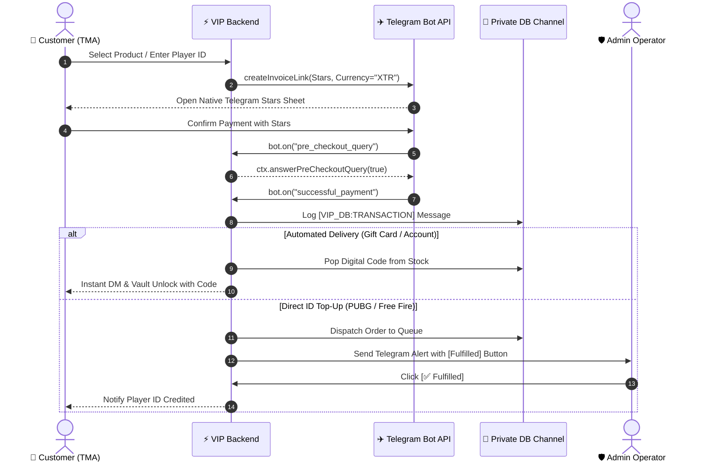

# 👑 VIP Card App - Telegram-Native Digital Marketplace

A premier Telegram Mini App (TMA) and serverless e-commerce platform specializing in digital gift cards (Binance USDT, LikeCard, PUBG UC, Gaming Vouchers), pre-loaded accounts (Twitter/X aged, FanSpicy, PUBG Glacier), and direct Player ID top-up services, using **Telegram Stars (XTR)** as the exclusive payment currency and a **Private Telegram Channel as the decentralized database ledger**.

---

## 🌟 Key Features

1. **Telegram-Native Storefront (TMA)**:
   - **Gift Cards**: Binance (USDT 10/25/50/100), LikeCard (KSA 🇸🇦, UAE 🇦🇪, Global 🌐), Gaming (PlayStation, Steam, iTunes).
   - **Pre-Loaded Accounts**: Aged verified Twitter/X accounts with 2FA, FanSpicy VIP, PUBG Mobile Mythic accounts.
   - **Direct Player ID Top-Up**: PUBG UC, Free Fire Diamonds, TikTok Coins with target player ID input and manual processing queue.
   - **Exclusive Currency**: Telegram Stars (XTR) with instant invoice popup and verification webhooks.
2. **Decentralized Telegram Channel Database**:
   - Zero traditional SQL/NoSQL databases.
   - Transactions, user point balances, stock codes, and orders are stored as structured JSON messages directly in a private Telegram Channel.
3. **Automated Digital Vault**:
   - Codes and account credentials unlocked instantly upon verified Telegram Stars payment.
   - Real-time one-click clipboard copy and reveal options.
4. **Loyalty & Gamification**:
   - 7-Day login streak calendar with escalating rewards.
   - Animated Lucky Wheel spin for bonus points and Stars.
   - Telegram referral system with 1-tap invite link sharing.
5. **Separate Admin Control Panel**:
   - Web & Bot-accessible operations center (`/admin.html` and `/admin` bot command).
   - Direct Top-Up queue with one-click **Fulfilled** / **Reject** buttons that trigger automated customer Telegram notifications.
   - Live Telegram Stars dynamic price editor and catalog management.
   - Bulk stock code injector for automated instant deliveries.
   - Live raw Telegram Channel Ledger message inspector.

---

## 🚀 Quick Start

### 1. Installation

```bash
# Navigate to project root
npm install
```

### 2. Configuration (`.env`)

Copy `.env.example` to `.env`:

```ini
# Telegram Bot Token from @BotFather
BOT_TOKEN=1234567890:ABCdefGHIjklMNOpqrSTUvwxYZ

# Private Database Channel ID (create a private channel and add bot as Administrator)
PRIVATE_DB_CHANNEL_ID=-1001234567890

# Admin Notification Channel ID (for direct top-up queue alerts)
ADMIN_QUEUE_CHANNEL_ID=-1001234567890

# Admin Telegram User IDs (comma separated)
ADMIN_USER_IDS=123456789

# Port & WebApp Domain Architecture
PORT=3000
APP_NAME="VIP Card App"
APP_DOMAIN=vipcardapp.com
ADMIN_DOMAIN=admin.vipcardapp.com
WEBAPP_URL=https://vipcardapp.com

# Admin Panel Secret Key
ADMIN_SECRET_KEY=vipadmin2026

# Firebase Integration (VIP Card App)
FIREBASE_PROJECT_ID=vipcardapp-app
```

> **Note**: If `BOT_TOKEN` or `PRIVATE_DB_CHANNEL_ID` are not yet filled, VIP Card App automatically boots in **Local Simulation Mode**, allowing complete testing of all store, stars payment, vault, and admin operations right in your browser.

### 3. Start the Platform

```bash
npm start
```

- **Customer Storefront (Mini App)**: [http://localhost:3000](http://localhost:3000) (or `https://vipcardapp.com`)
- **Admin Control Panel**: [http://localhost:3000/admin](http://localhost:3000/admin) (or `https://admin.vipcardapp.com` / `https://vipcardapp.com/admin`)

---

## 🔥 Firebase Integration & Hosting

VIP Card App is registered and linked to Firebase project **`vipcardapp-app`**:
- **Firebase Project ID**: `vipcardapp-app`
- **SDK Configuration**: Configured in [`public/js/firebase-config.js`](file:///c:/Users/ابوقيصر/Desktop/PRO/public/js/firebase-config.js) and loaded in both storefront & admin panel.
- **Unified Domain Routing**:
  - `vipcardapp.com` -> Customer TMA Storefront (`/index.html`)
  - `vipcardapp.com/admin` & `admin.vipcardapp.com` -> Admin Control Center (`/admin.html`)
- **Deploy to Firebase Hosting**:
  ```bash
  firebase deploy --only hosting
  ```

---

## 🤖 Configuring Telegram Mini App in @BotFather

1. Open [@BotFather](https://t.me/BotFather) on Telegram.
2. Use `/newbot` to create your bot and obtain your `BOT_TOKEN`.
3. Enable payments: use `/mybots` > choose your bot > **Payments** > **Telegram Stars** (enable Stars).
4. Set up the Mini App:
   - Run `/newapp` in @BotFather.
   - Select your bot.
   - Title: `VIP Card App`.
   - Description: `Premier Telegram-Native Marketplace for Gift Cards & Top-ups`.
   - WebApp URL: Enter your deployed HTTPS URL (e.g. `https://your-domain.com` or GitHub Pages).
   - Short name: `app` (your Mini App link will be `t.me/YourBot/app`).
5. Create your **Private Database Channel**:
   - Create a new Private Channel in Telegram (e.g. *VIP Card DB Ledger*).
   - Add your bot as an **Administrator** with permission to **Post Messages**.
   - Copy the channel ID (e.g., `-100...`) into `PRIVATE_DB_CHANNEL_ID`.

---

## 🌐 Deploying Frontend to GitHub Pages

The `public/` directory is built as a Single Page Application:

1. Push this repository to GitHub.
2. Go to **Repository Settings** > **Pages**.
3. Under **Build and deployment**, set Source to **Deploy from a branch**, Branch to `main`, folder to `/public`.
4. Click **Save**. Your TMA will be live at `https://<username>.github.io/<repo>/`.

---

## 📜 Telegram Stars Payment Workflow


